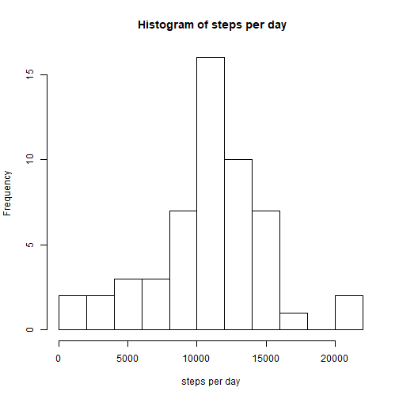
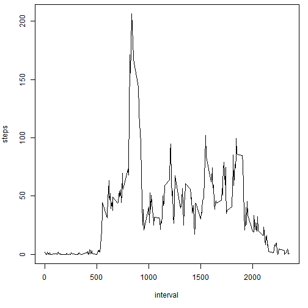
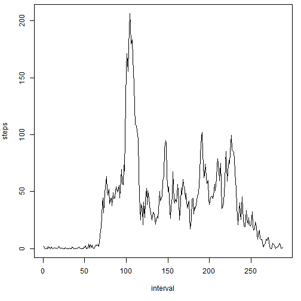
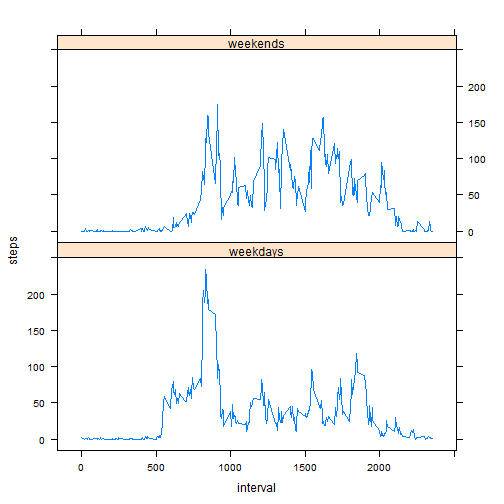

## Loading and preprocessing the data

```r
activity <- read.csv("activity.csv")
Sys.setlocale("LC_TIME","English")
```

```
## [1] "English_United States.1252"
```

```r
locale_original <- Sys.getlocale( category = "LC_TIME" )
```


## What is mean total number of steps taken per day?

```r
steps_date_sum <- tapply(activity$steps, activity$date, sum)
steps_date_sum <- as.data.frame(steps_date_sum)
steps_date_sum$date <- as.Date(rownames(steps_date_sum))
steps_date_sum$steps_date_sum <- as.numeric(steps_date_sum$steps_date_sum)
hist(steps_date_sum$steps_date_sum, xlab = "steps per day", main =" Histogram of steps per day", breaks = 10)
```



```r
steps_mean <- mean(steps_date_sum$steps_date_sum, na.rm = TRUE)
steps_median <- median(steps_date_sum$steps_date_sum, na.rm = TRUE)

mean_c <- paste0("The mean of the total number of steps taken per day is ", steps_mean, ".")
median_c <- paste0("The median of the total number of steps taken per day is ", steps_median, ".")

print(mean_c);print(median_c)
```

```
## [1] "The mean of the total number of steps taken per day is 10766.1886792453."
```

```
## [1] "The median of the total number of steps taken per day is 10765."
```


## What is the average daily activity pattern?

```r
steps_interval_mean <- tapply(activity$steps, activity$interval, mean, na.rm = TRUE)
steps_interval_mean <- as.data.frame(steps_interval_mean)
steps_interval_mean$interval <- as.numeric(rownames(steps_interval_mean))
steps_interval_mean$steps_interval_mean <- as.numeric(steps_interval_mean$steps_interval_mean)
par(mar=c(5,4,0.5,1))
plot(steps_interval_mean$interval, steps_interval_mean$steps_interval_mean, type="l",
     xlab = "interval", ylab = "steps")
```



```r
max_interval_mean <- max(steps_interval_mean$steps_interval_mean)
max_interval <- steps_interval_mean$interval[steps_interval_mean$steps_interval_mean==max_interval_mean]
print(max_interval)
```

```
## [1] 835
```

```r
print("The interval of 835 - 840 contains the maximum number of steps.")
```

```
## [1] "The interval of 835 - 840 contains the maximum number of steps."
```


## Imputing missing values

```r
n_na <- sum(is.na(activity$steps));print(n_na)
```

```
## [1] 2304
```

```r
activity.no_na <- activity
for(i in 1:nrow(activity)){
  if(is.na(activity$steps[i])==TRUE){
    intv <- activity$interval[i]
    intv_i <- which(steps_interval_mean$interval==intv)
    activity.no_na$steps[i] <- steps_interval_mean$steps_interval_mean[intv_i]
  }
}

steps_date_sum.no_na <- tapply(activity.no_na$steps, activity.no_na$date, sum)
steps_date_sum.no_na <- as.data.frame(steps_date_sum.no_na)
steps_date_sum.no_na$date <- as.Date(rownames(steps_date_sum.no_na))
steps_date_sum.no_na$steps_date_sum.no_na <- as.numeric(steps_date_sum.no_na$steps_date_sum.no_na)
hist(steps_date_sum.no_na$steps_date_sum.no_na, xlab = "steps per day", main =" Histogram of steps per day", breaks = 10)
```



```r
steps_interval_mean.no_na <- tapply(activity.no_na$steps, activity.no_na$interval, mean)
steps_interval_mean.no_na <- as.data.frame(steps_interval_mean.no_na)
steps_interval_mean.no_na$interval <- as.numeric(rownames(steps_interval_mean.no_na))
steps_interval_mean.no_na$steps_interval_mean.no_na <- as.numeric(steps_interval_mean.no_na$steps_interval_mean.no_na)
max_interval_mean.no_na <- max(steps_interval_mean.no_na$steps_interval_mean.no_na)
max_interval.no_na <- steps_interval_mean.no_na$interval[steps_interval_mean.no_na$steps_interval_mean.no_na==max_interval_mean.no_na]
print(max_interval)
```

```
## [1] 835
```

```r
print("The interval of 835 - 840 contains the maximum number of steps.")
```

```
## [1] "The interval of 835 - 840 contains the maximum number of steps."
```


## Are there differences in activity patterns between weekdays and weekends?

```r
days <- weekdays(as.Date(activity$date))
activity$day <- "weekdays"
weekends_ind <- which((days == "Saturday")|(days == "Sunday"))
activity$day[weekends_ind] <- "weekends"

wd <- subset(activity, day=="weekdays")
we <- subset(activity, day=="weekends")
steps_interval_mean.wd <- tapply(wd$steps, wd$interval, mean, na.rm = TRUE)
steps_interval_mean.wd <- as.data.frame(steps_interval_mean.wd)
steps_interval_mean.wd$interval <- as.numeric(rownames(steps_interval_mean.wd))
steps_interval_mean.wd$steps_interval_mean.wd <- as.numeric(steps_interval_mean.wd$steps_interval_mean.wd)
steps_interval_mean.we <- tapply(we$steps, we$interval, mean, na.rm = TRUE)
steps_interval_mean.we <- as.data.frame(steps_interval_mean.we)
steps_interval_mean.we$interval <- as.numeric(rownames(steps_interval_mean.we))
steps_interval_mean.we$steps_interval_mean.we <- as.numeric(steps_interval_mean.we$steps_interval_mean.we)
names(steps_interval_mean.wd)[1] <- "steps"
names(steps_interval_mean.we)[1] <- "steps"
steps_interval_mean.wd$day <- "weekdays"
steps_interval_mean.we$day <- "weekends"
steps_interval_mean.day <- rbind(steps_interval_mean.wd, steps_interval_mean.we)

library(lattice)
steps_interval_mean.day <- transform(steps_interval_mean.day, day = factor(day))
xyplot(steps~interval|day, data = steps_interval_mean.day, layout = c(1,2), type="l")
```


